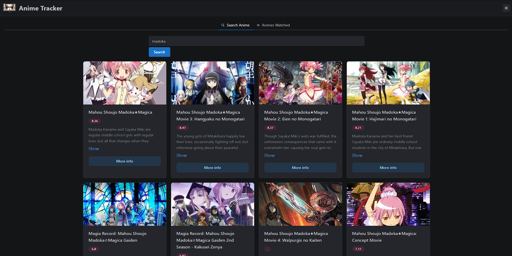
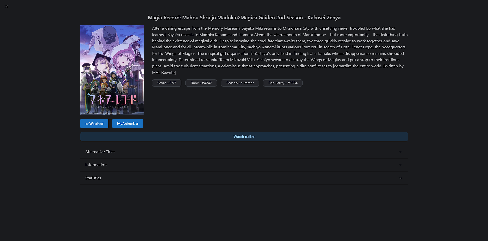

# Anime Tracker

Anime Tracker is a React application that allows users to search for anime titles and save them to the local storage for future reference.

## Features

- **Anime Search:** Search and explore a vast collection of anime titles.
- **Local Storage:** Save your favorite anime titles locally for quick access.
- **Responsive Design:** Enjoy a seamless experience on both desktop and mobile devices.

## Screenshots




## Installation

1. Clone this repository:

```bash
git clone https://github.com/your-username/anime-tracker.git
```

2. Navigate to the project directory: `cd anime-tracker`

3. Install dependencies: `npm install`

4. Start the application: `npm start`

5. Open your browser and visit `http://localhost:5173` to view the application.

## Usage

1. Use the search bar to find your favorite anime titles.
2. Click on the anime title to view details.
3. Save your favorite titles by clicking the "Save" button.

## Local Storage

Your saved anime titles will be stored in the local storage of your browser.

## Contributing

Contributions are welcome! If you have ideas for new features, improvements, or encounter issues, please create an issue or submit a pull request.
